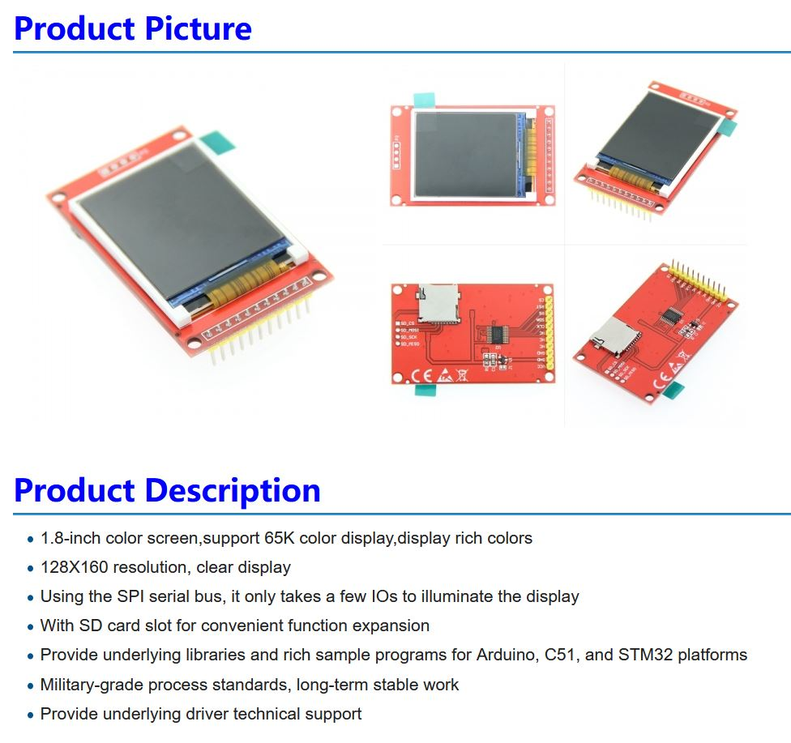
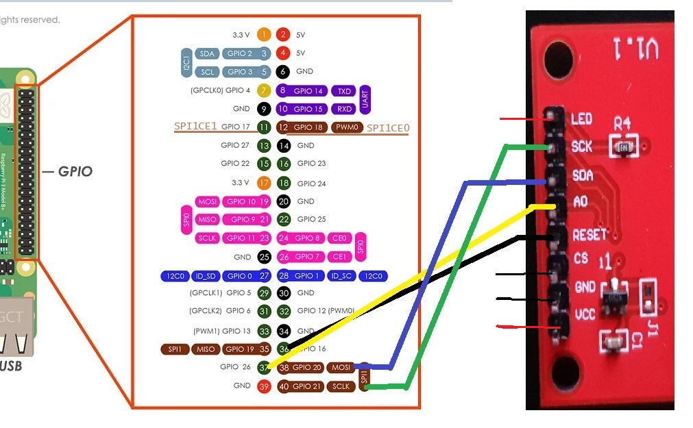

## RPICAM STREAM DEMO
https://github.com/ChrisStewart132/rpi_ST7735S_LCD/assets/30304173/15f0ddb7-d65c-49f5-a9d2-8b89218a76ce

https://github.com/ChrisStewart132/rpi_ST7735S_LCD/assets/30304173/c0736b39-0bb9-4a1f-b404-5bf1be6a9e27

# rpi_ST7735S_LCD

http://www.lcdwiki.com/1.8inch_Arduino_SPI_Module_ST7735S_SKU:MAR1801

## Table of Contents
- [Introduction](#introduction)
- [Features](#features)
- [Installation](#installation)
- [Usage](#usage)
- [Pinout](#pinout)

## Introduction

This repository contains C programs to interface between a rpi with a camera, and a 1.8" 128x160 16bit colour LCD.

## Features

- Stream 2bit, 4bit, and 8bit grayscale.
- Stream 16bit rgb 565.
- Documentation and example programs to test and increase understanding. 

## Installation
Install GPIOD 
```
sudo apt install libgpiod-dev
```
Clone repo
```
git clone https://github.com/ChrisStewart132/rpi_ST7735S_LCD.git
```
Change directory
```
cd rpi_ST7735S_LCD
```
Compile main programs (each program contains description and compile cmd)
```
gcc -o YUV420_to_2bit_grayscale YUV420_to_2bit_grayscale.c
gcc -o grayscale_2bit_to_16bit_RGB565 grayscale_2bit_to_16bit_RGB565.c

gcc -o YUV420_to_4bit_grayscale YUV420_to_4bit_grayscale.c
gcc -o grayscale_4bit_to_16bit_RGB565 grayscale_4bit_to_16bit_RGB565.c

gcc -o YUV420_to_RGB565_grayscale YUV420_to_RGB565_grayscale.c -lgpiod

gcc -o YUV420_to_RGB565 YUV420_to_RGB565.c -lgpiod

gcc -o ST7735S_LCD_stdin_stream ST7735S_LCD_stdin_stream.c -lgpiod
```
Enable rpi SPI1 (spi1-2cs) in the config.txt
```
cd /boot/firmware
sudo nano config.txt
// dtoverlay=spi1-2cs
cntrl x, save, yes
sudo reboot
```
## Usage
ST77355s_LCD_stdin_stream.c contains example usage
```
/**
 * Author: Christopher Stewart (Christopher.ray.stewart@gmail.com)
 * Date: 11062024
 * Description: program to display a 128x160 16bit rgb (565) stream from stdin on a ST7735S 1.8" 128x160 LCD
 * 
 * gcc -o ST7735S_LCD_stdin_stream ST7735S_LCD_stdin_stream.c -lgpiod
 * 
 * grayscale
 * rpicam-vid -t 0 -n --framerate 30 --width 128 --height 160 --codec yuv420 -o - | ./YUV420_to_RGB565_grayscale | ./ST7735S_LCD_stdin_stream
 * 
 * rgb565
 * rpicam-vid -t 0 -n --framerate 30 --width 128 --height 160 --codec yuv420 -o - | ./YUV420_to_RGB565 | ./ST7735S_LCD_stdin_stream
 * 
 * 4bit grayscale
 * rpicam-vid -t 20000 -n --framerate 24 --width 128 --height 160 --codec yuv420 -o - | ./YUV420_to_4bit_grayscale | ./grayscale_4bit_to_16bit_RGB565 | ./ST7735S_LCD_stdin_stream
 * 
 * 2bit grayscale
 * rpicam-vid -t 20000 -n --framerate 24 --width 128 --height 160 --codec yuv420 -o - | ./YUV420_to_2bit_grayscale | ./grayscale_2bit_to_16bit_RGB565 | ./ST7735S_LCD_stdin_stream
 * 
 */
```
With everything compiled, a rpi, camera, and ST7735S LCD wired to SPI1 run the above commands in the same directory e.g.
```
rpicam-vid -t 0 -n --framerate 30 --width 128 --height 160 --codec yuv420 -o - | ./YUV420_to_RGB565 | ./ST7735S_LCD_stdin_stream
```

## Pinout

